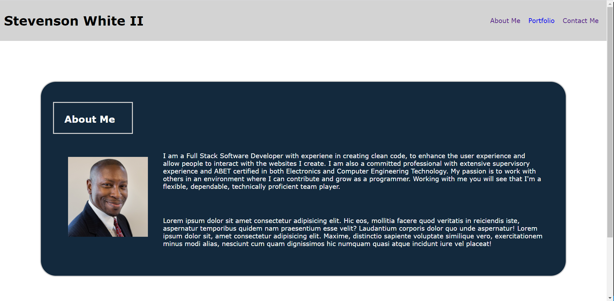
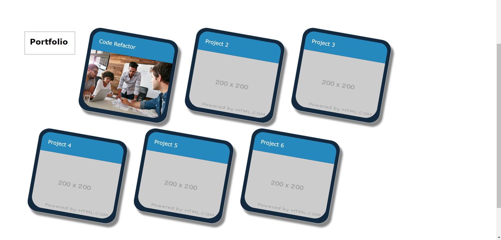

# My-Personal-Portfolio

## Advended CSS: Personal Portfolio Website

---

* Inside of this will be my very own personal portfolio website, where I get to showcase my newly developed coding skills. This is a way to show future employers that I know how to build responsive websites and they can track my projects going forward.

* Creating this profile will also show some of my creative skills as well as my thought process behind my design. I will be using the latest advanced CSS, such as media query, flex, creative classes, while creating navigational links and a form.

* My personal portfolio is made to be interactive with the user experience in mind.

* Since this is the begging of my coding journey, you will also find placeholder images in place of the projects, to be later filled with elegant and user-friendly projects. Take a look and enjoy exploring each of the pages as you click on the links and fill out the form on the Contact Me page.

* I have provided a README.MD file with the overview of my portfolio, a page with a brief description about me, a portfolio page for housing my projects, and a contact me page should you find the need for a focused and creative full stack web developer that can create beautiful works of art for you.

## Preview of My Portfolio

* This is a preview of my About Me page below:

* This is a preview of my Portfolio page below:

* This is a preview of my Contact Me page below:

## Project #1

* Gitub Repo Link: [Github.com](https://github.com/sawhite110/Anime-of-the-Day)

* Github Hosted Application Link: [Anime-of-the-Day]( https://sawhite110.github.io/Anime-of-the-Day/)

---

* The readme.md, index.html, portfolio.html, contact.html, style1.css, style2.css, style3.css files are updated and uplaoded to GitHub.

* My last step in this process is to render my page live on the internet, using GitHub Pages as the host server.